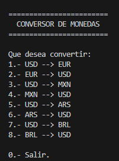
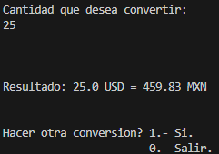

# Conversor de Moneda y Temperatura

Proyecto de conversor de moneda hecho para el challenge de Alura Latam ONE

Posee las funciones de Convertir Moneda.

- En la funcion de cambio de modena: Se puede pasar de Dólar, Euro, Peso Mexicano, Real Brasileño, y viceversa.

Este proyecto fue creado usando Java y Visual Studio Code como editor.

Para probar el programa, basta con abrir el proyecto en VSC y correrlo.

<big> Capturas de pantalla del programa

<small>

- Menu principal.

- Ejemplo Dolar a Peso Mexicano.

----

*Andres Casillas @ 2024*
